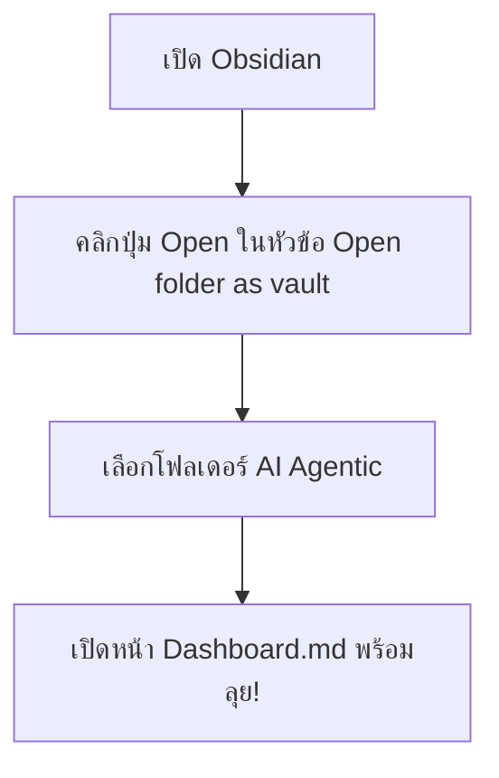

# คู่มือการเปิดใช้งาน AIOS Workspace ในโปรแกรม Obsidian (Step-by-Step)

คู่มือนี้แนะนำขั้นตอนการนำโฟลเดอร์โปรเจค `AI Agentic` ไปเปิดใช้งานและแชร์การทำงานร่วมกันในโปรแกรม Obsidian ตั้งแต่การกดปุ่มแรกสุดครับ

---

## 📥 ขั้นที่ 1: ติดตั้งโปรแกรม (หากยังไม่มี)
1. เข้าเว็บไซต์ [obsidian.md](https://obsidian.md)
2. ดาวน์โหลดเวอร์ชันที่เหมาะกับ OS ของคุณ (Mac, Windows, หรือ Linux) และติดตั้งลงเครื่อง

---

## 📂 ขั้นที่ 2: ดึงข้อมูลโปรเจคลงเครื่องคอมพิวเตอร์ของคุณ
หากเพื่อนร่วมทีมยังไม่มีโฟลเดอร์นี้ในเครื่อง ให้รันคำสั่งนี้ใน Terminal/Command Prompt เพื่อโคลนไฟล์ล่าสุดจาก GitHub:
```bash
git clone https://github.com/Phutawa/localhost-8080.git AI-Agentic
```
*(หากคุณเปิดจากเครื่องตัวเองที่มีโฟลเดอร์ `/Users/phutawanmueangma/Documents/Project/AI Agentic ` อยู่แล้ว สามารถข้ามข้อนี้ได้เลย)*

---

## 🧠 ขั้นที่ 3: เปิดโปรเจคเป็น "Vault" ใน Obsidian



1. **เปิดแอปพลิเคชัน Obsidian** ขึ้นมาในเครื่องคอมพิวเตอร์ของคุณ
2. ในหน้าจอแรกสุด (Choose Vault) คุณจะเจอกล่องตัวเลือกหลัก 3 กล่อง:
   - *Create new vault* (สร้างโฟลเดอร์ใหม่)
   - *Open folder as vault* (เปิดโฟลเดอร์ที่มีอยู่แล้ว)
   - *Open Obsidian Sync*
3. ให้มองหาหัวข้อ **"Open folder as vault"** จากนั้นคลิกปุ่ม **"Open"** สีน้ำเงินข้าง ๆ
4. หน้าต่างเลือกไฟล์จะเด้งขึ้นมา ให้เลือกชี้ไปที่โฟลเดอร์โปรเจค:
   - `/Users/phutawanmueangma/Documents/Project/AI Agentic `
5. คลิกปุ่ม **"Open"** หรือ **"Choose"** ที่มุมล่างขวา

---

## 🎨 ขั้นที่ 4: การใช้งานเบื้องต้น

1. **เปิดหน้า Dashboard หลัก:** 
   - ที่แถบสารบัญไฟล์ซ้ายมือ ให้ดับเบิ้ลคลิกเปิดไฟล์ที่ชื่อ `Dashboard.md`
   - หน้าจอจะโชว์ข้อมูลลิ้งก์นำทางสีสันสวยงาม คุณสามารถคลิกที่ป้ายลิงก์แต่ละตัว (เช่น `[[agents/engineering/dsp_engineer]]`) เพื่อโดดเข้าไปดูโปรไฟล์ของผู้ช่วยคนนั้น ๆ ได้ทันที
2. **เปิดโหมด Graph View (ดูเครือข่ายความสัมพันธ์ผู้ช่วย):**
   - มองหาปุ่ม **ไอคอนรูปใยแมงมุม / เครือข่าย (Open graph view)** ที่แถบเมนูแนวตั้งซ้ายสุด (หรือกดปุ่มลัด `Cmd + G` บน Mac หรือ `Ctrl + G` บน Windows)
   - ระบบจะเปิดหน้าจอกราฟความเชื่อมโยง โดยคุณจะเห็นเอเจนต์ทั้งหมดโยงหาทักษะและแผนบันทึกการทำงานอย่างมีมิติ
3. **ค้นหาด้วย Tags:**
   - ที่ช่องค้นหาด้านบนซ้าย ลองพิมพ์ค้นหา `#aios/agent` เพื่อดูข้อมูลของเอเจนต์ทั้งหมด หรือพิมพ์ `#aios/skill` เพื่อเรียกดูข้อมูลทักษะที่เก็บไว้ได้ทันทีครับ!
