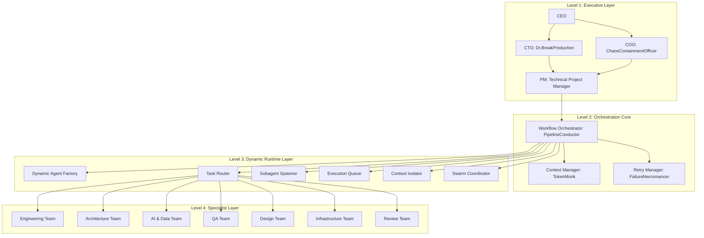
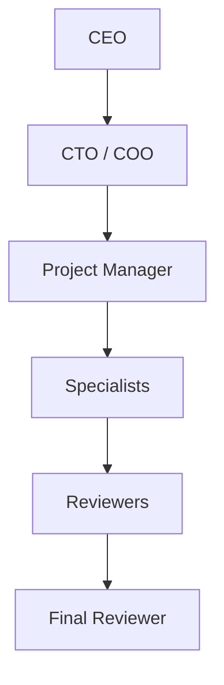
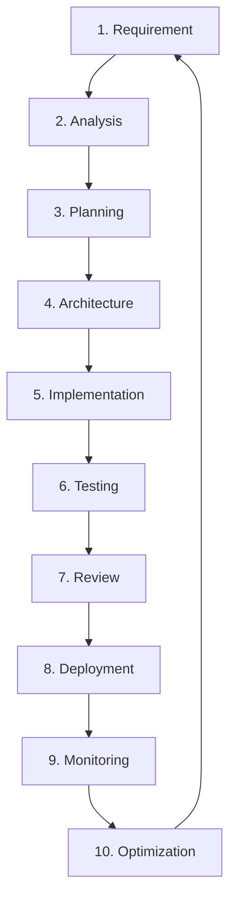
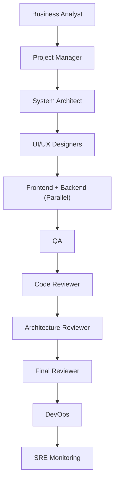
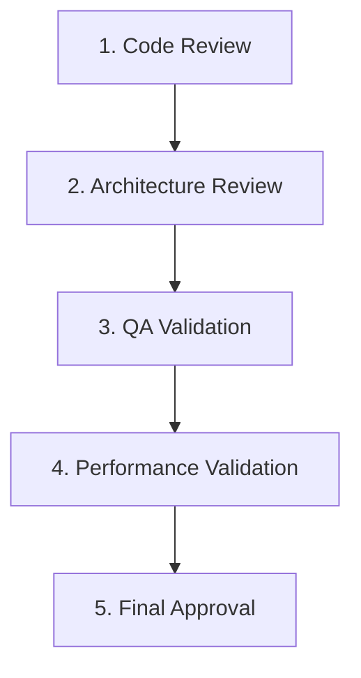
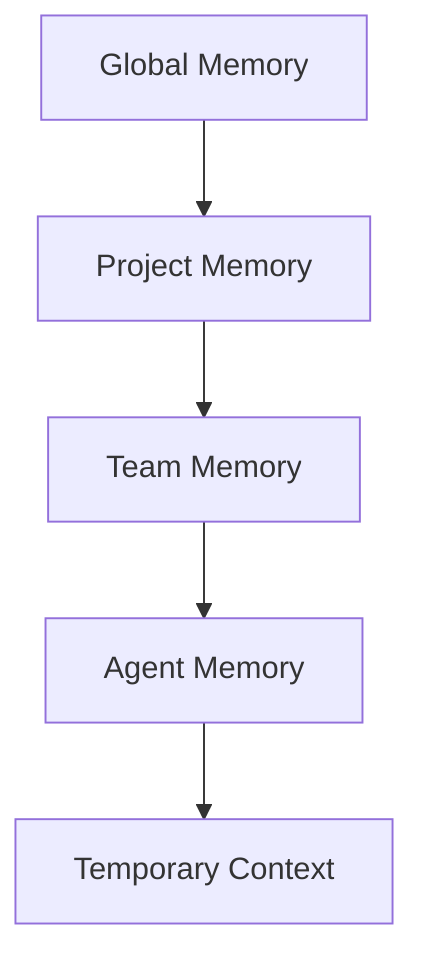
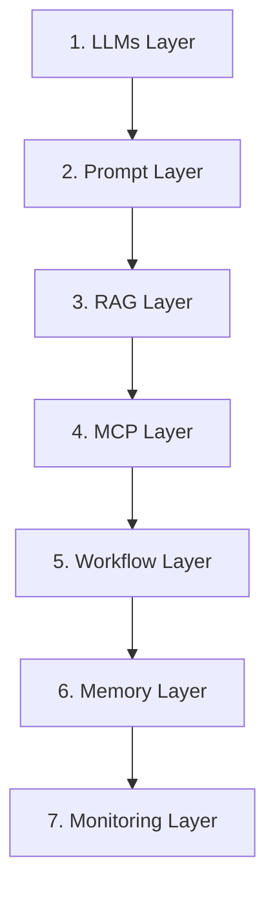
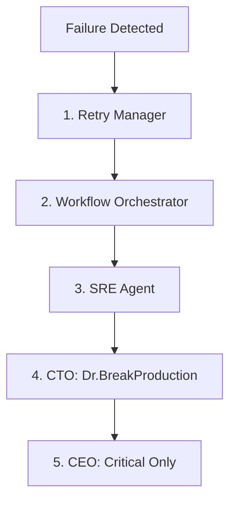

# AIOS Architecture Blueprint & Dynamic Runtime Specifications

This document defines the architectural patterns, component layers, dynamic runtime behaviors, and operational boundaries for the **AI Agentic** system (AIOS Pattern).

---

## ⚠️ Golden Rules (System Invariants)

These rules are strict, global constraints that must be upheld by all agents and automated pipelines at all times. Violations will trigger system halts:

* **No Direct Deployment Without Review:** No code, schema, or configurations may be deployed to production without passing the complete QA & Review Flow.
* **No Self-Approved Outputs:** Specialist agents are strictly forbidden from approving their own deliverables. All outputs must be validated by dedicated QA and Review agents.
* **No Architecture Changes Without CTO Review:** Any alteration to service boundaries, API contracts, database schemas, or infrastructure topology requires explicit sign-off from the CTO (**Dr.BreakProduction**).
* **No Production Access Without Security Validation:** Access to production environments or sensitive keys must be validated by the Security Architect (**CaptainFirewall**).
* **No Context Overflow:** Agents must proactively monitor token usage and run context compression via the Context Manager (**TokenMonk**) before breaching limits.
* **No Infinite Retries:** Task failures must strictly follow the Retry Strategy, halting and escalating to human operators at the 4th failure.

---


## 1. System Hierarchical Structure



## 1.1 Official Communication Flow



This sequence represents the formal validation, reporting, and sign-off hierarchy:
1. **Strategic Intent:** CEO issues requirements and high-level business goals.
2. **Technical & Operational Review:** CTO/COO evaluate scalability, feasibility, and workflow impact.
3. **Execution Planning:** Project Manager breaks down goals, assigns tasks, and coordinates delivery.
4. **Implementation:** Specialists (Frontend, Backend, AI, DevOps, etc.) develop the features.
5. **Quality Gate 1:** Reviewers (Code, Architecture, QA) check standards, patterns, and run test suites.
6. **Quality Gate 2:** Final Reviewer (GatekeeperPrime) gives the ultimate sign-off before production release.


## 1.2 Full Production Lifecycle



### Phase Definitions & Responsibilities:
1. **Requirement:** Driven by the **CEO** and **Business Analyst** to capture client demands and business objectives.
2. **Analysis:** The **Business Analyst** dissects requirements, evaluates business value, and resolves ambiguity.
3. **Planning:** The **Project Manager** and **Scrum Master** map deliverables, build the execution roadmap, and initialize tasks.
4. **Architecture:** The **Architecture Team** (System, Database, and Security Architects) designs system layers, service boundaries, and data schemas.
5. **Implementation:** Specialized engineering agents (Frontend, Backend, Mobile, Fullstack, AI) execute code construction.
6. **Testing:** The **QA Team** (QA Engineers and Performance Testers) performs end-to-end testing, integration tests, and stress testing.
7. **Review:** The **Review Team** (Code, Architecture, and Final Reviewers) ensures clean code, pattern compliance, and gives final sign-off.
8. **Deployment:** The **DevOps Team** automates the build and deploy processes via CI/CD pipelines.
9. **Monitoring:** The **SRE** and **SRE Agents** observe production telemetry, log tracks, and system health.
10. **Optimization:** The **Trend Analyst**, **ML/AI Engineers**, and specialists refine performance, compute costs, and system capabilities.


## 1.3 Website Generation Pipeline

This specialized pipeline outlines the execution flow specifically for web application projects:



### Pipeline Details:
* **Business Analyst:** Captures, refines, and formats user requirements.
* **Project Manager:** Decomposes features into sub-tasks and schedules them in execution queues.
* **System Architect:** Formulates frontend/backend service boundaries and API contracts.
* **UI/UX Designers:** SpacingOverlord and FlowSensei design user journeys, wireframes, and responsive design systems.
* **Frontend + Backend:** Engineers build client interfaces and backend endpoints concurrently.
* **QA:** BugHunter9000 performs functional tests, device responsiveness audits, and API checks.
* **Code Reviewer:** LintLord validates code quality, naming conventions, and patterns.
* **Architecture Reviewer:** MicroserviceProphet inspects integration boundaries and coupling.
* **Final Reviewer:** GatekeeperPrime validates requirements against completed deliverables for final sign-off.
* **DevOps:** DeployWarlock containerizes the app and automates deployments via CI/CD.
* **SRE Monitoring:** DowntimeExorcist configures observability, alarms, and tracks logs.


## 1.4 Quality Assurance & Review Flow

Every feature and release candidate must pass through a linear, gated review flow before deployment:



### Review Gate Definitions:
1. **Code Review:** Checked by **LintLord**. Audits syntax, naming conventions, checks for duplicate code block logic, and ensures unit tests are included.
2. **Architecture Review:** Checked by **MicroserviceProphet**. Inspects structural coupling, service boundaries, database design models, and evaluates security posture.
3. **QA Validation:** Checked by **BugHunter9000**. Conducts end-to-end integration testing, boundary conditions, edge case scenarios, and UI compatibility checks across viewports.
4. **Performance Validation:** Checked by **LoadDestroyer**. Simulates stress-load behaviors, monitors latency limits, detects memory leaks under load, and reports scalability bottlenecks.
5. **Final Approval:** Checked by **GatekeeperPrime**. Resolves requirement checklists, reviews QA execution logs, inspects security scans, and unlocks the deployment queue.


## 1.5 Agent Scaling Strategy

To optimize token efficiency and operational management, the AI company structure scales in progressive stages:

### Stage 1: Core Foundation (MVP Launch)
* **Active Agents:** Project Manager (PM) Agent, Frontend Engineer Agent, Backend Engineer Agent, QA Engineer Agent.
* **Goal:** Establish a minimal execution loop. Build, test, and verify basic functional prototypes.

### Stage 2: Quality & Operations (Structure Expansion)
* **Added Agents:** CTO (Dr.BreakProduction), DevOps Engineer, Code Reviewer, UI/UX Designers.
* **Goal:** Enforce strict coding standards, automate testing/deployments, and ensure UI/UX consistency.

### Stage 3: AI & Scalability (Advanced Optimization)
* **Added Agents:** RAG Engineer, Prompt Engineer, MCP Engineer, SRE Agent, Context Manager.
* **Goal:** Integrate advanced AI memory subsystems, custom tool binders, observability tracking, and token optimizations.

### Stage 4: Full Autonomous Swarm (Target AIOS State)
* **Active Agents:** All Executive, Engineering, Design, Infrastructure, Architecture, Validation, and AI Systems Layer agents operating concurrently.
* **Goal:** A self-organizing, self-optimizing, and self-healing autonomous software company.

---


## 2. Core Functional Requirements & Capabilities

| Capability | Specification |
| :--- | :--- |
| **Dynamic Subagents** | Ability to programmatically spawn new task-specific agents at runtime. |
| **Temporary Teams** | Grouping of dynamic agents to solve multi-faceted tasks, dissolved after task completion. |
| **Recursive Delegation** | Agents can delegate sub-tasks by spawning child subagents. Subject to `MAX_SUBAGENT_DEPTH`. |
| **Runtime Orchestration** | Dynamically adjusting task execution paths and DAG schedules based on intermediate outcomes. |
| **Agent Lifecycle** | Standardized initialization (spawn), execution tracking, output consolidation, and termination (destroy). |
| **Context Isolation** | Strictly separating memory spaces, variables, and workspace directories for each running subagent. |
| **Parallel Execution** | Running independent task paths concurrently across multiple agent threads. |
| **Swarm Coordination** | Multiple specialized subagents collaborating under a single joint task structure. |


## 2.1 Memory Layer Structure

To enable Context Isolation and prevent token explosion while preserving system state, memory is organized into hierarchical layers:



### Memory Layers Definition:
1. **Global Memory:** Company-level guidelines, core templates, system-wide policies, and organization-wide tools. Persistent across all projects.
2. **Project Memory:** Located in `/memory`. Contains project-specific requirements, database schemas, architectural patterns, decisions logs, and API contracts. Persistent across the project lifecycle.
3. **Team Memory:** Scoped to specific agent teams (e.g., Engineering Team, Design Team). Shares code templates, coding patterns, and team-specific configuration libraries. Persistent during the team's operational span.
4. **Agent Memory:** Scoped to an individual agent. Stores agent-specific execution history, internal state, specialized prompts, and task-specific workspace paths. Persistent across the agent's lifespan.
5. **Temporary Context:** Isolated to a single task execution path. Holds input parameters, local environment variables, intermediate variables, and temporary file artifacts. Short-lived; discarded or merged immediately upon task completion.


## 2.2 AI Stack Hierarchy

The AI technology stack is built in layers, flowing from core model capabilities down to execution monitoring:



### AI Stack Layer Definitions:
1. **LLMs (Foundation Layer):** Large Language Models (Gemini, Claude, GPT, etc.) providing core reasoning, parsing, and textual generation capabilities.
2. **Prompt Layer:** Structures model instructions, system parameters, few-shot examples, and JSON schemas to ensure deterministic outputs.
3. **RAG Layer:** Injects domain-specific semantic context into prompts, performing chunking, embedding, vector/lexical search, and cross-encoder re-ranking.
4. **MCP Layer:** Exposes local/remote tools, filesystems, and databases to the LLM via the Model Context Protocol.
5. **Workflow Layer:** Manages task dependencies, coordinates multi-agent DAGs, triggers retries, and schedules execution queues.
6. **Memory Layer:** Persists organizational guidelines, technical decisions, team assets, agent states, and short-term contexts.
7. **Monitoring Layer:** Evaluates runtime safety, tracks token budgets, logs latencies, and monitors error rates.

---


## 3. Dynamic Subagent Lifecycle

Every dynamic subagent must follow a strict, governed lifecycle to prevent memory leaks, resource bloat, and context contamination:

```
Spawn ──> Assign Context ──> Execute ──> Review ──> Merge Output ──> Destroy
```

1. **Spawn:** Agent Factory clones a specialist template and registers the agent in the Execution Queue.
2. **Assign Context:** Context Isolator provisions a local workspace, imports scoped memory, and injects parameters.
3. **Execute:** The subagent performs the designated task within its isolated environment.
4. **Review:** Outputs are validated by QA or Review agents.
5. **Merge Output:** Verified artifacts are integrated back into the parent project directory.
6. **Destroy:** Workspace is cleaned up, and agent resources are deallocated.

---

## 4. Key Orchestration & Runtime Agents

### 4.1 Dynamic Agent Factory
* **Role:** Dynamically spawns specialized, task-scoped subagents.
* **Responsibilities:**
  * Create temporary, task-specific agents.
  * Clone specialist templates.
  * Inject relevant local context.
  * Assign scoped responsibilities.
  * Destroy inactive/completed agents.
* **System Prompt Blueprint:**
  ```text
  You are an Agent Factory responsible for dynamically spawning specialized subagents.
  Responsibilities:
  - Create temporary task-specific agents
  - Clone agent templates
  - Inject relevant context
  - Assign scoped responsibilities
  - Limit context pollution
  - Destroy inactive agents
  Rules:
  - Spawn only when necessary
  - Prevent duplicate agents
  - Use minimal context
  - Keep agents task-scoped
  - Maintain execution efficiency
  ```

### 4.2 Task Router
* **Role:** Matches tasks to the correct agent/team and determines execution dependencies.
* **Responsibilities:**
  * Route tasks to appropriate domains (e.g., Auth API -> Backend/Auth team).
  * Assign task dependencies.
  * Optimize execution schedules.

### 4.3 Context Isolation System
* **Role:** Shields subagents from cross-task interference.
* **Guarantees:**
  * Local context memory.
  * Scoped token utilization thresholds.
  * Task-specific file sandboxing.

### 4.4 Execution Queue
* **States:** `Pending` ➔ `Assigned` ➔ `Running` ➔ `Reviewing` ➔ `Completed` ➔ `Archived`.


### 4.5 Runtime Engine Components

The core runtime orchestration is managed by executable python modules inside `/runtime/`:

* **[agent_loader.py](file:///Users/phutawanmueangma/Documents/Project/AI%20Agentic%20/runtime/agent_loader.py):** Loads agent profiles and injects base prompts.
* **[task_router.py](file:///Users/phutawanmueangma/Documents/Project/AI%20Agentic%20/runtime/task_router.py):** Evaluates task targets and routes them to correct layers.
* **[context_manager.py](file:///Users/phutawanmueangma/Documents/Project/AI%20Agentic%20/runtime/context_manager.py):** Establishes context sandboxes and triggers compression rules.
* **[execution_engine.py](file:///Users/phutawanmueangma/Documents/Project/AI%20Agentic%20/runtime/execution_engine.py):** Pulls tasks from the queue and schedules threads.
* **[memory_manager.py](file:///Users/phutawanmueangma/Documents/Project/AI%20Agentic%20/runtime/memory_manager.py):** Reads and writes data to shared memory logs.
* **[retry_handler.py](file:///Users/phutawanmueangma/Documents/Project/AI%20Agentic%20/runtime/retry_handler.py):** Applies retry algorithms with backoff and jitter.
* **[event_bus.py](file:///Users/phutawanmueangma/Documents/Project/AI%20Agentic%20/runtime/event_bus.py):** Distributes asynchronous message indicators between layers.

---


## 5. Advanced Flow & Recovery Logic

### 5.1 Recursive Delegation Depth Limit
To prevent infinite delegation loops and CPU/token exhaustion, all subagents must honor a maximum spawn depth:
$$\text{Current Depth} \le \text{MAX\_SUBAGENT\_DEPTH} = 3$$

### 5.2 Failure & Recovery Pipeline

The Retry Manager (FailureNecromancer) enforces a strict, step-by-step retry strategy for task failures:

| Failure Count | Action | Target / Description |
| :--- | :--- | :--- |
| **1st Failure** | **Retry** | Rerun the task using the same agent with exponential backoff and jitter. |
| **2nd Failure** | **Reassign** | Re-instantiate the subagent template and reassign the task to a fresh instance with an isolated environment. |
| **3rd Failure** | **Escalate** | Flag the failure in `/memory/incidents/` and escalate to the Project Manager and CTO (Dr.BreakProduction) or COO. |
| **4th Failure** | **Human Intervention** | Freeze the task execution queue, preserve workspace state, and wait for human operator intervention. |


## 5.3 Incident Pipeline

When a persistent or critical execution failure is detected, the incident flows through the following escalation pipeline:



### Escalation Hierarchy Details:
1. **Failure Detected:** A task execution node outputs an error state.
2. **Retry Manager:** Initiates local retry/reassignment loops (up to 2 failures).
3. **Workflow Orchestrator:** If local recovery fails (3rd failure), freezes the task line, logs the incident in `/monitoring/incidents/`, and notifies SRE.
4. **SRE (DowntimeExorcist):** Triages system stability, checks logs in `/monitoring/failures/`, and isolates the affected environments.
5. **CTO (Dr.BreakProduction) / COO:** Performs structural root-cause analysis, adjusts system blueprints, or re-allocates resources.
6. **CEO (Critical Only):** Engaged only for catastrophic system bottlenecks, resource exhaustion, or blocked project deliveries requiring strategic manual pivot.

---


## 6. Runtime Monitoring Metrics

The system tracks and monitors execution metrics continuously:
* **Agent Health:** Heartbeat and responsiveness tracking.
* **Execution Time:** Performance bottlenecks and idle times.
* **Token Usage:** Cumulative cost and input/output tokens per task.
* **Memory Load:** Context window consumption.
* **Failure Rate:** Error frequencies per agent/class.
* **Task Completion Rate:** Real-time throughput against the target DAG.

---

## 7. Operational Governance & Rules

* **Task Assignment Authority:** Specialists do **NOT** self-assign work. All execution tasks must be systematically decomposed, prioritized, and assigned by the Project Manager (PM) or dispatched via the Workflow Orchestrator.
* **Strict Scope Boundaries:** Specialists are constrained to operate strictly within the boundaries of their assigned tasks and isolated contexts.
* **Memory & Context Optimization:** To prevent context overflow and preserve historical project context:
  * **Preserve critical decisions:** Maintain a chronological, immutable log of architectural and technical decisions in `/memory/technical_decisions/`.
  * **Compress repetitive discussions:** Condense long logs and redundant iteration discussions into key highlights and action items.
  * **Remove redundant logs:** Regularly prune execution trace files and debug outputs, leaving only high-level outcomes.
  * **Summarize completed phases:** Compile summaries of changes, features built, and test results into `/memory/summaries/` upon phase completion.
  * **Maintain architectural continuity:** Evaluate all modifications against the active system blueprint to prevent architectural drift.
* **Agent Communication Format:** All inter-agent message exchanges and task handoffs must conform to the following structured YAML format:
  ```yaml
  Task: <Task Name>
  Assigned_Agent: <Agent Name / Role>
  Priority: <Low / Medium / High / Critical>
  Dependencies: [<Dependent Tasks>]
  Expected_Output: <Description of deliverables>
  Deadline: <YYYY-MM-DD>
  Status: <Pending / Assigned / Running / Reviewing / Completed / Archived>
  ```


---

## 8. Future Evolution & Autonomous Roadmap

The system is designed to gradually evolve towards a fully autonomous, self-optimizing software entity:

* **Autonomous Startup:** Enabling the system to define product goals, manage its own operational treasury, and pivot strategic directions autonomously based on market demand.
* **AI Software Factory:** Continuous, automated generation of specialized microservices, libraries, and integrations with zero human manual coding.
* **Self-Improving Workflows:** Dynamically auditing operational bottlenecks and rewriting orchestrator DAGs to optimize delivery speed.
* **Autonomous Debugging:** Automated incident log parsing coupled with direct code-patching and regression test loops to self-heal live crashes.
* **Autonomous Architecture Optimization:** Continuous performance profiling of databases, network APIs, and compute configurations to execute automated refactoring and reduce cloud costs.
* **AI-Native Operating Company:** The final evolution state—a fully autonomous business system capable of spawning project teams, optimizing itself, and delivering production value end-to-end.


