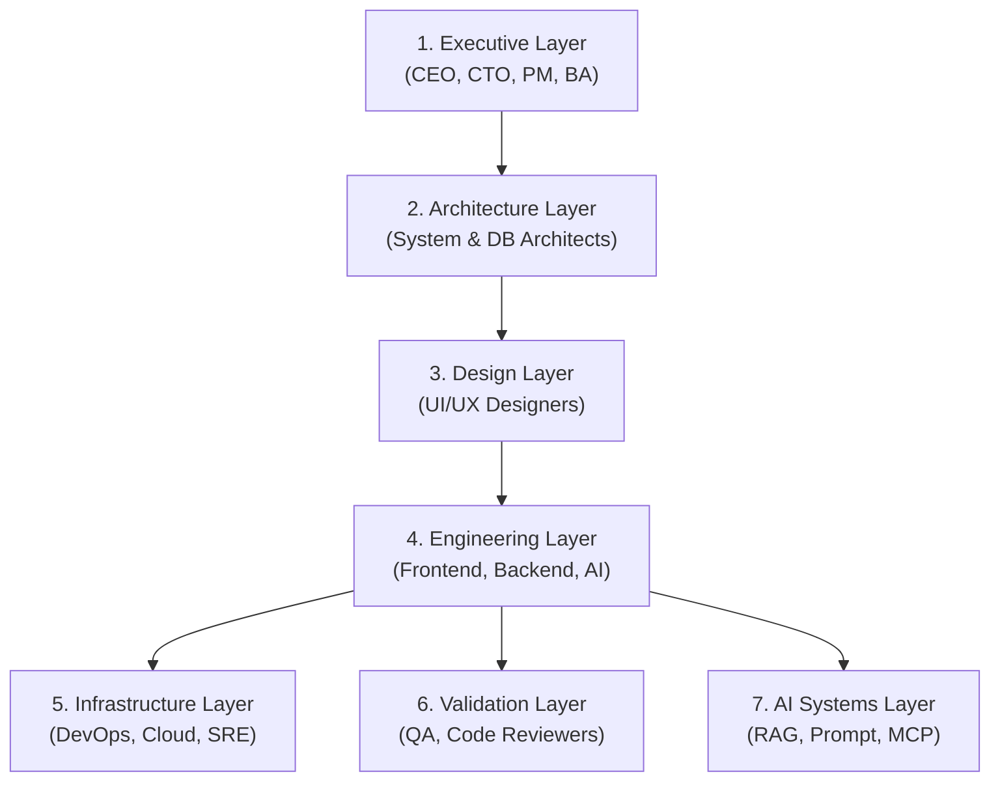

# รายงานการศึกษากระบวนการและโครงสร้างการทำงานของ AI Agent (AIOS Core)

ระบบในโฟลเดอร์นี้คือ **AIOS (AI Agentic Operating System)** ซึ่งออกแบบขึ้นมาเพื่อทำระบบพัฒนาซอฟต์แวร์และรันงานธุรกิจผ่านความร่วมมือของ AI Agents หลายตัว (Multi-Agent System) โดยแบ่งโครงสร้างและการทำงานออกเป็น 3 ส่วนหลัก ดังนี้:

---

## 1. โครงสร้างระดับเลเยอร์ของ AI Agents (Layered Organization)

เอเจนต์ในระบบนี้ถูกจัดหมวดหมู่เลเยอร์การทำงานเลียนแบบองค์กรพัฒนาซอฟต์แวร์จริงทั้งหมด 7 เลเยอร์:

### 📋 รายละเอียดแต่ละเลเยอร์
1. **Executive (ผู้บริหารและวางแผน):**
   * **CEO Agent:** กำหนดทิศทางธุรกิจ ประสานงานภาพรวม และอนุมัติ/ปฏิเสธผลลัพธ์
   * **Business Analyst (SherlockRequirements):** วิเคราะห์ความต้องการทางธุรกิจ เขียนความต้องการทางเทคนิคลงใน `/memory/project_requirements.md`
   * **Project Manager:** แตกงานและแจกจ่ายงานให้ทีมต่าง ๆ
   * **Scrum Master (SprintMonk):** จัดทำและควบคุมแผนงานใน `/memory/sprint_tasks.md`
2. **Architecture (สถาปัตยกรรมระบบ):**
   * **System Architect (LordOfTheLayers):** ออกแบบ API Specification
   * **Database Architect (IndexSlayer):** ออกแบบ Data Schema และโครงสร้าง Relational Database
   * **Security Architect (CaptainFirewall):** ตรวจสอบความปลอดภัย ช่องโหว่ และ Webhook signing
3. **Design (การออกแบบหน้าตาและประสบการณ์):**
   * **UI Designer (SpacingOverlord) / UX Designer (FlowSensei):** สร้าง User Journey แผนผังหน้าจอ และบันทึก Mockup ใน `/artifacts/ui_mockups/`
4. **Engineering (ทีมพัฒนาโค้ด):**
   * **Frontend Engineer (PixelProphet) / Backend Engineer (LordOfEndpoints) / Fullstack Engineer / Mobile Engineer / ML & AI Engineers:** พัฒนาฟีเจอร์ต่าง ๆ ใน Sandbox ย่อยตามหน้าที่
5. **Infrastructure (โครงสร้างระบบ):**
   * **DevOps (DeployWarlock):** แพ็ก Container (Docker) และตั้งค่า CI/CD
   * **Cloud Engineer (SkyInfrastructureGod):** ควบคุมโครงสร้างพื้นฐานผ่าน Terraform (เช่น ตั้งค่า Redis, Supabase Database)
   * **SRE Engineer (DowntimeExorcist):** ตรวจจับความผิดปกติของระบบปลายทางและตั้งค่า Alert Thresholds
6. **Validation (การทดสอบและความถูกต้อง):**
   * **Code Reviewer (LintLord):** ตรวจสอบไวยากรณ์ (Linting) และความครอบคลุมของเทส (Coverage)
   * **QA Agent (BugHunter9000):** ทำ E2E Testing ค้นหาบั๊กและข้อบกพร่อง
   * **Performance Tester (LoadDestroyer):** ทำการทดสอบโหลดเพื่อป้องกัน Webhook หรือ Connection Pool ตัน
   * **Final Reviewer (GatekeeperPrime):** ตรวจสอบรายงานความถูกต้องทั้งหมดก่อนกดอนุมัติขึ้นงานจริง
7. **AI Systems (การจัดการความรู้และระบบเสริม):**
   * ทำหน้าที่สนับสนุนการดึงข้อมูล เช่น การทำ **RAG**, การสร้าง **Prompt Templates** และการปรับตั้งค่าระบบภายนอกผ่าน **MCP (Model Context Protocol)**

---

## 2. กระบวนการทำงานวงจรชีวิต (Multi-Agent Workflow Lifecycle)

ระบบทำงานประสานกันผ่านขั้นตอน 6 ระยะหลักตามคู่มือ [production_workflow_guide.md](file:///Users/phutawanmueangma/Documents/Project/AI%20Agentic%20/workflows/production_workflow_guide.md):

1. **Phase 1: Ingestion & Planning (รับโจทย์และวางแผน)**
   * เริ่มจาก CEO/User ส่งงาน -> BA วิเคราะห์ข้อกำหนด -> PM แตกงาน -> Scrum Master วางตารางงานและจัดลำดับ Dependencies ในไฟล์เมมโมรีส่วนกลาง
2. **Phase 2: Design & Architecture (ออกแบบ)**
   * สถาปนิกและทีมดีไซน์ร่าง Schema, API Spec และ UI layouts พร้อม ๆ กัน
3. **Phase 3: Parallel Implementation (เขียนโค้ดแบบขนาน)**
   * เอเจนต์นักพัฒนา (FE, BE, AI) จะทำงานในโฟลเดอร์ Sandbox แยกส่วนเพื่อเขียนโค้ดและสร้างหน้าเว็บร่วมกัน
4. **Phase 4: Gated Review Pipeline (ตรวจสอบผ่านด่าน)**
   * ก่อนเอาโค้ดมารวมกัน ต้องผ่านการตรวจสอบทีละด่าน: Code Quality -> Architecture -> QA Verification -> Load Test -> Final Approval
5. **Phase 5: CI/CD & Deployment (ติดตั้งขึ้นเซิร์ฟเวอร์)**
   * DevOps สร้าง container image และติดตั้งขึ้นเซิร์ฟเวอร์จริง (เช่น Vercel, Kubernetes)
6. **Phase 6: Observability & Self-Healing (เฝ้าระวังและเยียวยาตัวเอง)**
   * เอเจนต์ SRE ตรวจจับความผิดพลาด หากเกิดบั๊กหรือระบบล่ม **Retry Manager (FailureNecromancer)** จะวิเคราะห์ไฟล์ล็อกแล้วกู้ระบบคืนอัตโนมัติ

---

## 3. สถาปัตยกรรมระบบหลังบ้าน (Under-the-Hood Runtime Engine)

ระบบรันไทม์ในโฟลเดอร์ `runtime/` เป็นตัวขับเคลื่อน AI Agents เหล่านี้:

* **Agent Loader ([agent_loader.py](file:///Users/phutawanmueangma/Documents/Project/AI%20Agentic%20/runtime/agent_loader.py)):** อ่านไฟล์โปรไฟล์ Markdown (.md) เพื่อดึงตัวตน ข้อกำหนด และหน้าที่ของแต่ละเอเจนต์เข้าไปสร้างเป็น System Instructions สำหรับส่งต่อให้โมเดล AI (Gemini 3.5)
* **Task Router ([task_router.py](file:///Users/phutawanmueangma/Documents/Project/AI%20Agentic%20/runtime/task_router.py)):** วิเคราะห์ชื่องานแล้วโยนงานให้ทีมที่ใช่ เช่น เจองานที่มีคำว่า "database" จะสั่งให้ส่งไปเลเยอร์ `architecture` ทันที
* **Execution Engine ([execution_engine.py](file:///Users/phutawanmueangma/Documents/Project/AI%20Agentic%20/runtime/execution_engine.py)):** ควบคุมคิวการประมวลผลงานของเอเจนต์ต่าง ๆ ทีละขั้นตอน
* **Context Manager ([context_manager.py](file:///Users/phutawanmueangma/Documents/Project/AI%20Agentic%20/runtime/context_manager.py)):** คุมปริมาณ Token ของแต่ละเอเจนต์ให้อยู่ในกรอบ โดยหากขีดจำกัดทะลุ 80% ของ Token สูงสุด จะทำการย่อประวัติการสนทนา (Prune/Compress Context)
* **Memory Manager ([memory_manager.py](file:///Users/phutawanmueangma/Documents/Project/AI%20Agentic%20/runtime/memory_manager.py)):** เก็บประวัติการตัดสินใจเชิงสถาปัตยกรรม (Technical Decisions) ลงไฟล์รวมเพื่อให้เอเจนต์ทั้งหมดอัปเดตข้อมูลตรงกัน
* **LLM Provider ([llm_provider.py](file:///Users/phutawanmueangma/Documents/Project/AI%20Agentic%20/runtime/llm_provider.py)):** ทำหน้าที่เชื่อมต่อและยิง API ไปยัง **Gemini 3.5 Flash** (ซึ่งใช้ API Key จากไฟล์ `.env`) เพื่อรับและแกะโครงสร้างผลลัพธ์จากโมเดล
