# ข้อเสนอแนะในการปรับปรุงและพัฒนาระบบ AIOS Runtime

จากการศึกษารหัสต้นฉบับในโฟลเดอร์ `runtime/` พบว่าโครงสร้างสถาปัตยกรรมหลักถูกวางไว้ค่อนข้างดี แต่ยังมีหลายโมดูลที่ยังเป็นเพียง **โครงร่างจำลอง (Skeleton)** หรือยังไม่ได้เชื่อมต่อเข้ากับตัวควบคุมระบบหลัก รวมถึงมีข้อจำกัดด้านการรันงานจริงที่ต้องได้รับการปรับปรุงดังนี้ครับ:

---

## 1. จุดบกพร่องและช่องว่างของระบบในปัจจุบัน (System Gaps) [✓ แก้ไขเสร็จสิ้นทั้งหมดแล้ว]

### 🟢 [✓] 1.1 ไฟล์อินพุตไม่ได้ถูกดึงเนื้อหาไปใช้งานจริง (Missing File Ingestion)
* **สถานะ:** **แก้ไขสำเร็จแล้ว**
* **วิธีแก้ไข:** ปรับเปลี่ยน [cli.py](file:///Users/phutawanmueangma/Documents/Project/AI%20Agentic%20/runtime/cli.py) ให้อ่านไฟล์ข้อความดิบจริงผ่านฟังก์ชัน `open()` แล้วบรรจุเนื้อหาเข้าไปใน Task Payload ภายใต้คีย์ `"Input_Data"` และปรับปรุง [execution_engine.py](file:///Users/phutawanmueangma/Documents/Project/AI%20Agentic%20/runtime/execution_engine.py) ให้ดึงข้อมูลดังกล่าวมาสร้างเป็นบริบทเนื้อหาป้อนเข้าโมเดล AI จริง
* **ผลลัพธ์:** เอเจนต์สามารถเข้าถึงรายละเอียดของไฟล์อินพุต (เช่น รายละเอียดบั๊กใน `bug_reports.md`) ได้อย่างถูกต้องสมบูรณ์

### 🟢 [✓] 1.2 โมดูลระบบสำคัญถูกปิดทิ้งไว้ (Unused / Dead Code)
* **สถานะ:** **แก้ไขสำเร็จแล้ว**
* **วิธีแก้ไข:**
  * **RetryHandler:** นำเข้ามาห่อหุ้ม API Call ของ Gemini ด้วย `self.retry_handler.execute_with_retry` ใน [execution_engine.py](file:///Users/phutawanmueangma/Documents/Project/AI%20Agentic%20/runtime/execution_engine.py) และปรับแก้ [llm_provider.py](file:///Users/phutawanmueangma/Documents/Project/AI%20Agentic%20/runtime/llm_provider.py) ให้โยน Exception จริงเพื่อให้ RetryHandler ตรวจจับได้
  * **EventBus:** นำมาอินพอร์ต ตั้งค่า Callback ล็อคอิน (subscribe) ใน [cli.py](file:///Users/phutawanmueangma/Documents/Project/AI%20Agentic%20/runtime/cli.py) และสั่งยิงเหตุการณ์ (publish) `task_started` / `task_completed` จาก [execution_engine.py](file:///Users/phutawanmueangma/Documents/Project/AI%20Agentic%20/runtime/execution_engine.py)
  * **Context Pruning:** ปรับปรุงให้บันทึกข้อความลง ContextManager จริง และประเมิน Token เมื่อทำงานจบแต่ละรอบเพื่อสั่ง Compress Context ผ่าน `prune_context()`
* **ผลลัพธ์:** ฟีเจอร์ความปลอดภัย การส่งสาร และประเมินสเตตัสพร้อมใช้งานสมบูรณ์

### 🟢 [✓] 1.3 การประมวลผลเป็นแบบไร้สถานะ (Stateless Agent Execution)
* **สถานะ:** **แก้ไขสำเร็จแล้ว**
* **วิธีแก้ไข:** นำระบบบันทึกประวัติการส่งคำสั่งของเอเจนต์เข้าสู่คลังข้อความใน `ContextManager` ทำให้สเตจการประมวลผลเอเจนต์สามารถเรียกใช้ประวัติสนทนาเดิมเพื่อความต่อเนื่องของฟังก์ชันงานได้ พร้อมแก้ไขปัญหาการละทิ้ง `Agent_Context` โดยโหลดโปรไฟล์ของเอเจนต์จากโฟลเดอร์ `agents/` ไปใช้เป็น System Instruction แทนที่จะใช้ Prompt ตายตัว
* **ผลลัพธ์:** AI ทำตามบทบาทและบริบทของตัวเองได้เต็มที่และมีความจำต่อเนื่อง

### 🟢 [✓] 1.4 ไม่มีกลไกการรันแบบขนานจริง (Lack of True Parallelism)
* **สถานะ:** **แก้ไขสำเร็จแล้ว**
* **วิธีแก้ไข:** ปรับแก้ใน [execution_engine.py](file:///Users/phutawanmueangma/Documents/Project/AI%20Agentic%20/runtime/execution_engine.py) จากเดิมที่รันงานเดี่ยวในลูป เปลี่ยนมาใช้ **`ThreadPoolExecutor`** เพื่อกระจายงานในคิวให้ทำพร้อม ๆ กันแบบขนาน
* **ผลลัพธ์:** ระบบรันไทม์รองรับการทำงานขนานจริง (Concurrency) เรียบร้อยแล้ว

---

## 2. แผนการปรับปรุงและพัฒนา (Proposed Action Plan)

เพื่อทำให้ระบบขึ้นสถานะ Production-Ready แนะนำให้ปรับแก้โค้ดดังนี้ครับ:

```mermaid
graph TD
    subgraph Current ["สถาปัตยกรรมปัจจุบัน (Stateless & Seq)"]
        TaskQueue[Queue] -->|One by One| RunEngine[ExecutionEngine]
        RunEngine -->|Stateless prompt| LLM[Gemini API]
    end

    subgraph Proposed ["แนวทางสถาปัตยกรรมใหม่"]
        NewQueue[Queue] -->|ThreadPoolExecutor| ParallelEngine[ExecutionEngine Async]
        ParallelEngine -->|Read file content| ContentIngest[Ingest File Content]
        ContentIngest -->|Retrieve history| ContextStore[(Context Manager)]
        ContextStore -->|Wrapped in RetryHandler| NewLLM[Gemini API with Retries]
        NewLLM -->|Notify state change| Bus[EventBus]
    end
```



### 🛠️ 1. ปรับปรุงการโหลดเนื้อหาของไฟล์จริง (File Ingestion)
แก้ไขไฟล์ [cli.py](file:///Users/phutawanmueangma/Documents/Project/AI%20Agentic%20/runtime/cli.py) หรือ [execution_engine.py](file:///Users/phutawanmueangma/Documents/Project/AI%20Agentic%20/runtime/execution_engine.py) ให้อ่านไฟล์อินพุตและแนบเข้าไปใน User Prompt:
```python
# ตัวอย่างโค้ดปรับปรุงการอ่านอินพุต
input_contexts = []
for inp in inputs:
    inp_path = os.path.join(workspace_dir, inp)
    if os.path.exists(inp_path):
        with open(inp_path, "r", encoding="utf-8") as f:
            input_contexts.append(f"Content of {inp}:\n{f.read()}\n")
```

### 🛠️ 2. หุ้มการเชื่อมต่อ API ด้วย RetryHandler
นำ [RetryHandler](file:///Users/phutawanmueangma/Documents/Project/AI%20Agentic%20/runtime/retry_handler.py) เข้ามารับช่วงต่อคำสั่งเรียก LLM ใน [execution_engine.py](file:///Users/phutawanmueangma/Documents/Project/AI%20Agentic%20/runtime/execution_engine.py):
```python
from runtime.retry_handler import RetryHandler

retry_handler = RetryHandler(max_retries=3)

# หุ้มการเรียก API
result = retry_handler.execute_with_retry(
    LLMProvider.generate,
    prompt=user_prompt,
    system_prompt=system_prompt
)
```

### 🛠️ 3. เชื่อมต่อ Context History ในระบบประมวลผล
แก้ไขให้มีการบันทึกและประเมิน Token ในหน่วยความจำโดยเรียกใช้ `prune_context` หลังทำงานเสร็จทุกรอบ:
```python
# บันทึกสารลงใน Context Manager และประเมิน Token
context_manager.active_contexts[agent_role]["messages"].append({"role": "user", "content": user_prompt})
context_manager.active_contexts[agent_role]["messages"].append({"role": "model", "content": result})
# ตรวจจับขีดจำกัด
context_manager.prune_context(agent_role)
```

### 🛠️ 4. นำ EventBus มาใช้เป็นจุดรับส่งข้อมูลการเปลี่ยนสถานะ
ให้ [ExecutionEngine](file:///Users/phutawanmueangma/Documents/Project/AI%20Agentic%20/runtime/execution_engine.py) ประกาศเหตุการณ์ (Publish) เมื่อเริ่มงาน หรือจบงาน เพื่อให้เอเจนต์ตัวอื่นตอบสนองต่อเหตุการณ์ได้แบบเรียลไทม์
