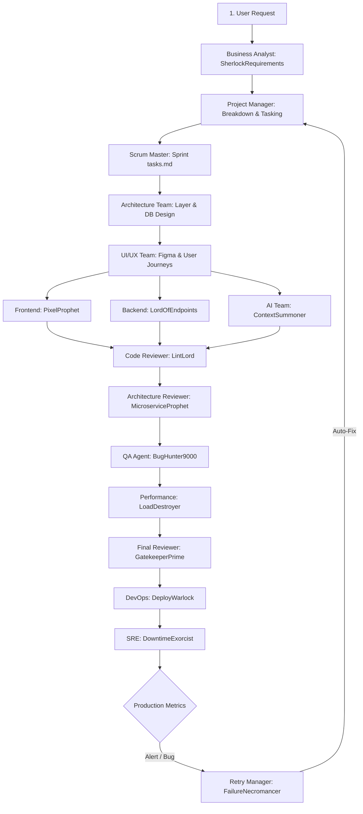

# Production-Grade Multi-Agent Workflow Guide

This document specifies the exact, step-by-step workflow of how the **AIOS multi-agent system** handles a production feature request from ingestion to live monitoring and self-healing.

---

## 1. Complete Workflow Lifecycle Diagram

---

## 2. In-Depth Phase Execution

### Phase 1: Ingestion & Planning (Requirement & Analysis)
1. **Request Ingestion:** The **CEO Agent** or User submits a business goal (e.g., *"Integrate Stripe Subscription Billing"*).
2. **Analysis:** **SherlockRequirements (BA)** performs competitive research, checks API limitations (Stripe docs), and writes `/memory/project_requirements.md`.
3. **Decomposition:** The **Project Manager** parses the requirements, creates tasks using the **Agent Communication Format**, and populates the backlog.
4. **Sprint Backlog:** **SprintMonk (Scrum Master)** schedules tasks in `/memory/sprint_tasks.md`, organizing dependencies.

---

### Phase 2: Design & Architecture
1. **Schema & API Contract:** 
   * **IndexSlayer (DB Architect)** designs relational schemas (e.g., Stripe customer mapping) in `/memory/architecture_notes.md`.
   * **LordOfTheLayers (System Architect)** defines API boundaries and updates `/memory/api_specs.md`.
   * **CaptainFirewall (Security)** audits the Stripe webhook signing and session validation models.
2. **Visual Layout:** **SpacingOverlord (UI)** and **FlowSensei (UX)** design user flows, error states, and responsive checkout forms, saving layouts in `/artifacts/ui_mockups/`.

---

### Phase 3: Dynamic Runtime & Parallel Implementation
1. **Sandbox Provisioning:** The **Dynamic Agent Factory** spawns isolated workspace branches for the developer agents:
   * **Frontend Agent (PixelProphet)**: Clones Next.js + Tailwind templates.
   * **Backend Agent (LordOfEndpoints)**: Clones FastAPI + Prisma templates.
2. **Execution:**
   * **FE Agent** builds the checkout UI in `/artifacts/frontend/`.
   * **BE Agent** implements the `/api/v1/billing` endpoints in `/artifacts/backend/`.
   * **Prompt/RAG Engineers** configure customer onboarding conversational responses in `/artifacts/documentation/`.

---

### Phase 4: Gated Review Pipeline (Quality Gates)
Before merging any artifact to main, the **Workflow Orchestrator** locks the pipeline and routes artifacts through these gates:
1. **Gate 1: Code Review (LintLord):** Run tests, lint checkers, and verify test coverage.
2. **Gate 2: Architecture Review (MicroserviceProphet):** Checks backend-to-frontend coupling.
3. **Gate 3: QA Validation (BugHunter9000):** Executes automated E2E tests, verifying success checkout and invalid payment edge cases.
4. **Gate 4: Performance Validation (LoadDestroyer):** Runs load tests to ensure webhook processing does not exhaust connection pools.
5. **Gate 5: Final Approval (GatekeeperPrime):** Reviews the verification reports and signs off the release.

---

### Phase 5: CI/CD & Deployment
1. **Containerization:** **DeployWarlock (DevOps)** builds Docker images.
2. **Infrastructure IaC:** **SkyInfrastructureGod (Cloud)** runs Terraform scripts to provision Supabase database scales and Redis cache nodes.
3. **Release:** The release is deployed to hosting platforms (Vercel / Kubernetes).

---

### Phase 6: SRE Observability & Telemetry (Self-Healing Loop)
1. **Observability:** **DowntimeExorcist (SRE)** configures Grafana metrics and Prometheus alert thresholds.
2. **Incident Pipeline:**
   * If a Stripe webhook times out, **DowntimeExorcist** detects the alert.
   * **FailureNecromancer (Retry Manager)** checks the `/monitoring/failures` log.
   * **Retry Loop:**
     * *1st Failure:* Triggers automated task retry.
     * *2nd Failure:* Re-instantiates webhook worker container.
     * *3rd Failure:* Escalates to PM / CTO for hot-patching.
